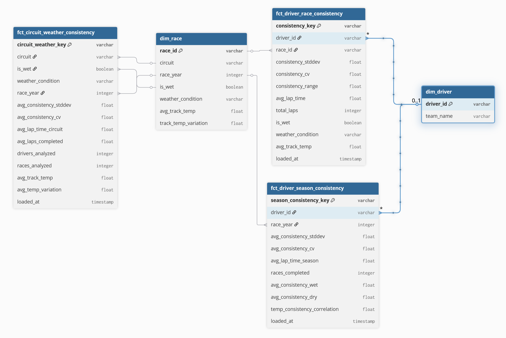
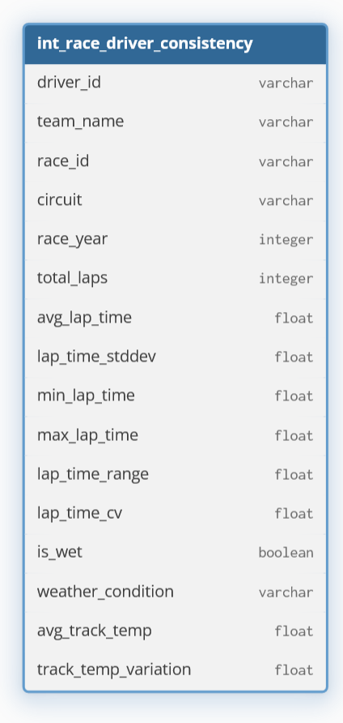
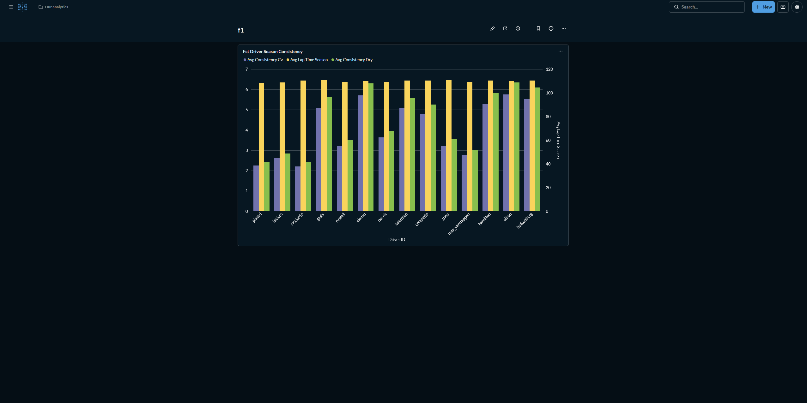

Name: `<insert here>`
Class: `<insert here>`
Teacher: `<insert here>`

---

# Phase 0 — Load to Raw

The raw dataset contains four file types per race: `laps`, `weather`, `session_results`, and `race_control`. A Python load script (`load/load.py`) consolidates all files by:

1. **Parsing filenames** to extract the year, circuit, and file type
2. **Adding context fields** (`race_year`, `circuit`, `race_id`) to each row
3. **Loading data** into separate tables (`raw_lap_times`, `raw_weather`, etc.)

---

# Phase 1 — Staging

Three staging models clean the raw data:

- **stg_lap_times**: Converts `LapTime` to seconds, removes invalid laps, and renames columns for consistency
- **stg_session_results**: Adds `is_finished` flag and standardizes driver IDs to lowercase
- **stg_weather**: Aggregates weather per race with `is_wet` flag and average temperature metrics

Data types were corrected (VARCHAR to seconds for lap times), and tests ensure non-null values for key fields like `driver_id`, `race_id`, and `lap_time_seconds`.

---

# Phase 2 — Intermediate Model

## Analytical Questions

**Pre-defined question:** What is the lap time variability for each driver within each race?

**Additional question:** How does lap time consistency vary between wet and dry race conditions for each driver, and does this consistency pattern differ by circuit?

Both questions focus on understanding driver consistency, which is critical for race strategy decisions like pit stop timing and tire management. The additional question adds weather as a dimension to help engineers understand how drivers perform under different conditions.

## Foundation

**Required staging models:**
- `stg_lap_times` – provides lap-by-lap timing data
- `stg_session_results` – provides driver finish status
- `stg_weather` – provides weather context per race

**Join keys:**
- `DriverNumber` (common to both lap times and session results)
- `race_id` (ensures correct race matching)

**Base fields carried forward:** `driver_id`, `team_name`, `race_id`, `circuit`, `race_year`, `lap_number`, `lap_time_seconds`, `tire_compound`, `tire_life`

## Added Fields

| Field                  | Definition                            | Why Needed                                                   |
|------------------------|---------------------------------------|--------------------------------------------------------------|
| `total_laps`           | COUNT(lap_number) per driver per race | Counts how many laps the driver completed                    |
| `avg_lap_time`         | AVG(lap_time_seconds)                 | Baseline for calculating consistency                         |
| `lap_time_stddev`      | STDDEV(lap_time_seconds)              | Primary measure of lap time variation                        |
| `lap_time_range`       | MAX - MIN lap time                    | Simple measure of lap time spread                            |
| `lap_time_cv`          | (stddev / avg) * 100                  | Normalized consistency measure for comparing across circuits |
| `is_wet`               | From weather staging                  | Enables wet/dry comparison                                   |
| `weather_condition`    | From weather staging                  | Human-readable weather label                                 |
| `avg_track_temp`       | From weather staging                  | Temperature context for analysis                             |
| `track_temp_variation` | From weather staging                  | Temperature stability during race                            |

The **Coefficient of Variation (CV)** is the key metric because it normalizes by average lap time, allowing fair comparisons across circuits with different lap lengths.

## Intermediate Model Design

The intermediate model (`int_race_driver_consistency`) serves as the analytical foundation for all fact tables. It combines lap times with session results (filtering to finished drivers) and weather data, then groups by driver and race to calculate consistency metrics.

**Granularity:** One row per driver per race

**Key operations:**
1. Filter to finished drivers using `stg_session_results`
2. Join lap times using `DriverNumber` and `race_id`
3. Add weather context from `stg_weather`
4. Group by driver and race to calculate statistics

The DBML diagram in `design.dbml` reflects this structure with all base and derived fields.

---

# Phase 3 — Star Model

## Analytical Questions

**Pre-defined question:** What is the lap time variability for each driver within each race?
- **Fact table:** `fct_driver_race_consistency` (primary granularity)

**Additional question:** How does lap time consistency vary between wet and dry race conditions for each driver, and does this consistency pattern differ by circuit?
- **Fact tables:** `fct_driver_season_consistency` (driver-season roll-up) and `fct_circuit_weather_consistency` (circuit-weather roll-up)

## Each Row Represents (Grain)

| Fact Table | Grain |
|------------|-------|
| `fct_driver_race_consistency` | Each row represents one **driver** in one **race** |
| `fct_driver_season_consistency` | Each row represents one **driver** in one **season** |
| `fct_circuit_weather_consistency` | Each row represents one **circuit** with one **weather condition** in one **season** |

## Metrics

### fct_driver_race_consistency (Primary Granularity)

| Metric name | Source field | Statistical operation | Justification |
|-------------|--------------|----------------------|---------------|
| `consistency_stddev` | `lap_time_seconds` | STDDEV | Measures absolute variation in lap times |
| `consistency_cv` | `lap_time_seconds` | (STDDEV / AVG) * 100 | Normalized measure for comparing across circuits |
| `consistency_range` | `lap_time_seconds` | MAX - MIN | Simple measure of lap time spread |
| `avg_lap_time` | `lap_time_seconds` | AVG | Baseline average pace |
| `total_laps` | `lap_number` | COUNT | Number of laps completed |

### fct_driver_season_consistency (Roll-up 1)

| Metric name | Source field | Statistical operation | Justification |
|-------------|--------------|----------------------|---------------|
| `avg_consistency_cv` | `consistency_cv` | AVG | Overall season consistency |
| `avg_consistency_wet` | `consistency_cv` (wet only) | AVG | Consistency specifically in wet conditions |
| `avg_consistency_dry` | `consistency_cv` (dry only) | AVG | Consistency specifically in dry conditions |
| `races_completed` | `race_id` | COUNT DISTINCT | Number of races analyzed |
| `temp_consistency_correlation` | `avg_track_temp` & `consistency_cv` | CORR | Relationship between temperature and consistency |

### fct_circuit_weather_consistency (Roll-up 2)

| Metric name | Source field | Statistical operation | Justification |
|-------------|--------------|----------------------|---------------|
| `avg_consistency_cv` | `consistency_cv` | AVG | Average consistency for this circuit-weather combo |
| `avg_consistency_stddev` | `consistency_stddev` | AVG | Average variation in lap times |
| `drivers_analyzed` | `driver_id` | COUNT DISTINCT | Number of drivers represented |
| `races_analyzed` | `race_id` | COUNT DISTINCT | Number of races represented |
| `avg_track_temp` | `avg_track_temp` | AVG | Average temperature for this condition |

## Star Model Design

The star schema consists of two dimension tables and three fact tables.

**Dimensions:**
- `dim_driver`: Contains unique driver IDs and team names
- `dim_race`: Contains unique race IDs with circuit, year, and weather context

**Fact Tables:**
1. `fct_driver_race_consistency` (primary granularity) – links to both dimensions
2. `fct_driver_season_consistency` (roll-up) – links to driver and race dimensions via driver_id and race_year
3. `fct_circuit_weather_consistency` (roll-up) – links to race dimension via circuit, is_wet, and race_year

The design allows analysts to drill down from season-level or circuit-level views to individual driver-race performance. All fact tables share common metrics (CV, stddev) but at different aggregation levels, enabling flexible analysis for race strategy decisions.

---

# Phase 4 — Dashboard

## Grain and Data Interpretation

The grain of our data significantly impacts how stakeholders interpret driver consistency patterns. Our three fact tables represent different levels of aggregation, each providing unique insights for decision-making:

1. **Driver-Race Granularity** (`fct_driver_race_consistency`): This level shows individual driver performance in specific races, enabling teams to evaluate:
   - Driver-specific performance under varying conditions
   - Consistency patterns within single races
   - Pit strategy effectiveness

2. **Driver-Season Granularity** (`fct_driver_season_consistency`): This roll-up level provides a broader view of driver capabilities across an entire season:
   - Overall consistency trends for drivers
   - Performance in wet vs. dry conditions
   - Seasonal improvement or decline patterns

3. **Circuit-Weather Granularity** (`fct_circuit_weather_consistency`): This perspective helps understand track and weather-specific challenges:
   - Circuit characteristics that affect consistency
   - Weather impact on overall racing performance
   - Optimal tire strategies for different conditions

## Dashboard Structure and Stakeholder Insights

The dashboard is designed to support three primary user groups with distinct analytical needs:

### Race Strategy Team
- **Key Metrics**: Consistency CV, average lap time, wet/dry comparison
- **Insights Gained**: 
  - Which drivers show the most consistent performance in wet conditions
  - Optimal timing for pit stops based on driver consistency patterns
  - Circuit-specific strategies based on weather impact

### Performance Analysts
- **Key Metrics**: Seasonal trends, correlation between temperature and consistency
- **Insights Gained**:
  - Long-term driver performance improvements or declines
  - Relationship between environmental factors and consistency
  - Comparative analysis across different drivers and circuits

### Technical Development Team
- **Key Metrics**: Lap time variation, track temperature impact
- **Insights Gained**:
  - Tire compound effectiveness under different conditions
  - Vehicle setup adjustments for maintaining consistency
  - Predictive modeling based on historical performance patterns

The dashboard's drill-down capabilities allow users to move from high-level season trends to specific race-level insights, supporting data-driven decisions at every level of the organization.

---

# Use of Generative AI

I used DeepSeek AI as a technical assistant for this project. 
The AI was used to help interpret error logs, understand dbt and DuckDB errors, and assist with detailing technical explanations in the report. 
All code, design decisions, and analytical choices are my own. The AI was used only for debugging support and documentation clarity.