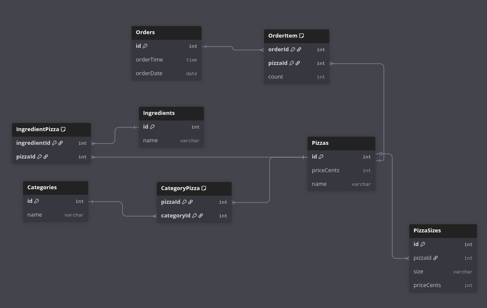
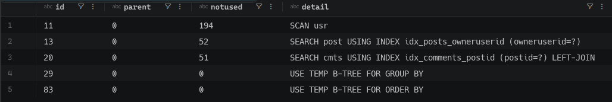
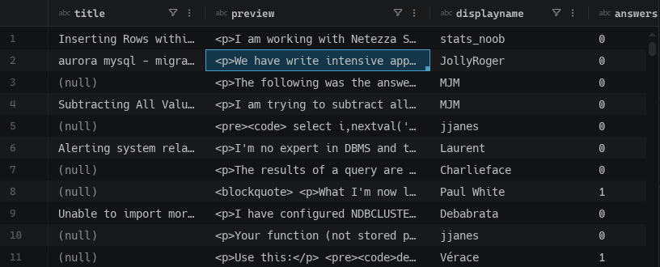
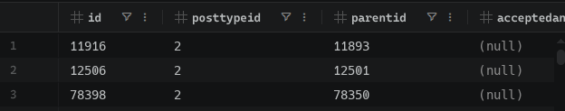
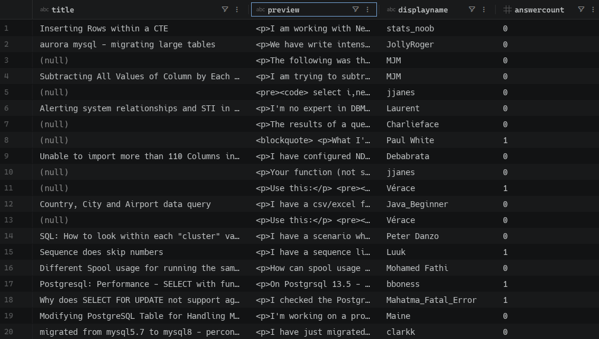
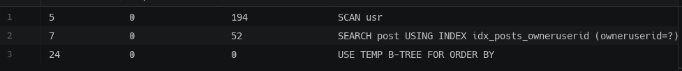

# Gate A — Answer Sheet

## Instructions

* Areas marked `<insert here>` are where you write your answers.
* Areas marked `![screenshot]` are where you paste screenshots.
* **Tip — pasting screenshots:** Use the [Paste Image](https://marketplace.visualstudio.com/items?itemName=mushan.vscode-paste-image) VS Code extension (Built into container).
* **Tip — export to PDF:** Use the [Markdown PDF](https://marketplace.visualstudio.com/items?itemName=yzane.markdown-pdf) VS Code extension. Export and submit the PDF to Brightspace (Built into container).

---

## Student Info

**Name:** `Job bouwhuis`
**Class:** `Sb`
**Teacher:** `Melanie Bonnes`

---

# Part 1 — Pizza Normalization

**Exercise:** `student-preload → gatekeepers/gate-a-pizza`

---

## Improved ERD

Design your improved schema in [dbdiagram.io](https://dbdiagram.io/) starting from the provided `pizza.dbml`.

**Screenshot of your improved ERD:**



---

## Justification

Explain your design choices in your  **own words** . For each change you made, answer:

* What did you change?
* Why did you change it? (What problem does it solve?)

it was one table with lots of data that belongs to different data models, now its multible tables so that data can be structured once,
and therefor no duplicate data exists (unless i missed something)

---

# Part 2 — StackExchange Optimization

**Exercise:** `student-preload → gatekeepers/gate-a-stackexchange`

---

## Part 2.1 — Baseline Performance

### Query 1 — Search

Find questions or answers that mention the word `postgres` in the title or body.

**SQL:**

```sql
SELECT *
FROM posts
WHERE title LIKE '%postgres%'
   OR body LIKE '%postgres%';
```

**Explanation (in your own words):**
select everything from posts where title or body contains "postgres" anywhere in them

**Screenshot — Query Plan:**


**Screenshot — First 3 Records:**


---

### Query 2 — Questions Overview

Show all questions sorted by date descending, including the first 200 characters of the content, the number of answers, and the username of the author.

**SQL:**

```sql
SELECT
    post.title,
    SUBSTR(post.body, 1, 200) AS preview,
    usr.displayname,
    COUNT(cmts.id) AS answers
FROM Posts post
LEFT JOIN Comments cmts ON cmts.postid = post.id
JOIN Users usr ON usr.id = post.owneruserid
ORDER BY post.creationdate DESC;
```

**Explanation (in your own words):**
selecting the title the first at most 200 characters of the body from posts
joining comments to get the number of answers
joining on user to get the poster displayname
and ordering by post date descending

**Screenshot — Query Plan:**


**Screenshot — First 3 Records:**


---

### Query 3 — Insert Answer

Insert a new answer for an existing question.

**SQL:**

```sql
INSERT INTO Comments (postid, userid, text)
VALUES (
    733,
    171,
    'This was inserted!!!'
);
```

**Explanation (in your own words):**
there isnt much to explain here.....

---

## Part 2.2 — Optimize

### Indexes

**SQL to create indexes:**

```sql
CREATE INDEX idx_posts_title ON Posts(title);

CREATE INDEX idx_posts_body ON Posts(body);

CREATE INDEX idx_comments_body ON Comments(body);
```

**Explanation — why these columns, why these index types:**
used for text queries, such as the earlier %postgres%

---

### Denormalization & Triggers

**SQL — Alter table (add denormalized column):**

```sql
ALTER TABLE Posts
ADD answercount INTEGER DEFAULT 0;
```

**SQL — Populate the new column:**

```sql
UPDATE Posts
SET answercount = (
    SELECT COUNT(*)
    FROM Comments
    WHERE Comments.postid = Posts.id
);
```

**SQL — Trigger(s) to keep it in sync:**

```sql
CREATE TRIGGER trg_comments_insert
AFTER INSERT ON Comments
BEGIN
    UPDATE Posts
    SET answercount = answercount + 1
    WHERE id = NEW.postid;
END;

CREATE TRIGGER trg_comments_delete
AFTER DELETE ON Comments
BEGIN
    UPDATE Posts
    SET answercount = answercount - 1
    WHERE id = OLD.postid;
END;
```

**Explanation — what you denormalized and why:**
now instead of having to join coments on their postid back to the current post, and counting the amount of coments we have, its just a column that is kept in sync.

---

## Part 2.3 — Compare Results

### Query 1 — Search (Optimized)

**SQL:**

```sql
SELECT *
FROM posts
WHERE title LIKE '%postgres%'
   OR body LIKE '%postgres%';
```

**Explanation — what changed and what impact did it have:**
it was faster, thats generally what indexing does

**Screenshot — Query Plan:**


**Screenshot — First 3 Records:**


---

### Query 2 — Questions Overview (Optimized)

**SQL:**

```sql
SELECT
    post.title,
    SUBSTR(post.body, 1, 200) AS preview,
    usr.displayname,
    post.answercount
FROM Posts post
JOIN Users usr ON usr.id = post.owneruserid
ORDER BY post.creationdate DESC;
```

**Explanation — what changed and what impact did it have:**
removed the joining on comments stripping thousands of checks. making it faster

**Screenshot — Query Plan:**


**Screenshot — First 3 Records:**


---

### Query 3 — Insert Answer (Optimized)

**SQL:**

```sql
INSERT INTO Comments (postid, userid, text)
VALUES (
    733,
    171,
    'This was inserted after indexing was added!'
);
```

**Explanation — what changed and what impact did it have:**
still dont know what to explain here, it inserts the comment. 
only thing i can add now is that it upped the answercount on the post it was added to due to the trigger ¯\\\_(ツ)\_/¯

