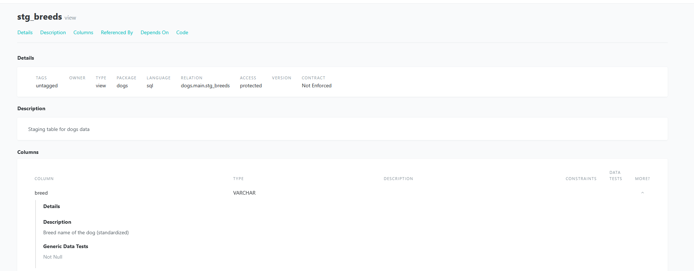
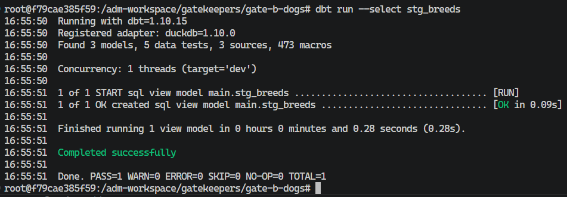
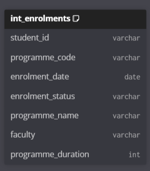

# Gate B — Answer Sheet

## Instructions

* Areas marked `<insert here>` are where you write your answers.
* Areas marked `![screenshot]` are where you paste screenshots.
* **Tip — pasting screenshots:** Use the [Paste Image](https://marketplace.visualstudio.com/items?itemName=mushan.vscode-paste-image) VS Code extension (Built into container).
* **Tip — export to PDF:** Use the [Markdown PDF](https://marketplace.visualstudio.com/items?itemName=yzane.markdown-pdf) VS Code extension. Export and submit the PDF to Brightspace (Built into container).
* **Gate B requires both sections below to be complete before your sign-off conversation.**

---

## Student Info

**Name:** `Job Bouwhuis`
**Class:** `2-Sb`
**Teacher:** `Melanie Bonnes`

---

# Part 1 — Dogs: Trustworthy Staging Data

**Exercise:** `student-preload → gatekeepers/gate-b-dogs`

---

## 1.1 — Source Configuration

Describe what you added to `sources.yml` to register the `breeds` table.

**What you added (paste relevant section of sources.yml):**

```yaml
      - name: breeds
        description: "Table loaded directly from source containing information about dog breeds."
```

---

## 1.2 — Staging Model

**File created:** `models/staging/stg_dogs.sql`

Paste your completed staging model below:

```sql
WITH source AS (

    SELECT *
    FROM {{ source('dogs', 'breeds') }}

),

decoded AS (

    SELECT
        lower(trim(breed)) AS breed,
        lower(trim("group")) AS breed_group,

        TRY_CAST(REPLACE(score, ',', '.') AS DECIMAL(5,2)) AS score,
        TRY_CAST(REPLACE(longevity, ',', '.') AS DECIMAL(5,1)) AS longevity,

        CAST(ailments AS INTEGER) AS ailments,
        CAST(purchase_price AS INTEGER) AS purchase_price,

        CASE grooming
            WHEN 1 THEN 'daily'
            WHEN 2 THEN 'weekly'
            WHEN 3 THEN 'few_weeks'
            ELSE NULL
        END AS grooming,

        CASE children
            WHEN 1 THEN 'high'
            WHEN 2 THEN 'medium'
            WHEN 3 THEN 'low'
            ELSE NULL
        END AS children_suitability,

        lower(trim(size)) AS size,

        TRY_CAST(REPLACE(NULLIF(weight, 'NA'), ',', '.') AS DECIMAL(5,2)) AS weight,

        TRY_CAST(NULLIF(height, 'NA') AS INTEGER) AS height,

        CASE TRIM(repetition)
            WHEN '<5' THEN '<5'
            WHEN '5-15' THEN '5-15'
            WHEN '15-25' THEN '15-25'
            WHEN '25-40' THEN '25-40'
            WHEN '40-80' THEN '40-80'
            WHEN '>80' THEN '>80'
            ELSE NULL
        END AS repetition_bucket

    FROM source
)

SELECT *
FROM decoded
```

**Explain your key decisions (in your own words):**

* What columns did you rename or standardise, and why?
* Were any columns removed or cast to a different type? Why?

`I renamed group to breed_group because group is a SQL keyword and the new name is clearer. I also standardized breed and size by trimming whitespace and converting them to lowercase to ensure consistent values for analysis.`

---

## 1.3 — Data Quality Tests

**Paste the relevant section of `schema.yml` covering `stg_dogs`:**

```yaml
 - name: stg_breeds
    description: "Staging table for dogs data"
    docs:
      node_color: "maroon"
    columns:
      - name: breed
        description: "Breed name of the dog"
        data_type: STRING
        tests:
          - not_null:
              config:
                severity: error
          - unique:
              config:
                severity: error

      - name: breed_group
        description: "AKC breed group classification"
        data_type: STRING

      - name: score
        description: "AKC score"
        data_type: NUMBER

      - name: longevity
        description: "Typical lifespan in years"
        data_type: NUMBER

      - name: purchase_price
        description: "Average purchase price (USD equivalent)"
        data_type: NUMBER

      - name: grooming
        description: "Grooming requirement decoded from numeric encoding (daily/weekly/few_weeks)"
        data_type: STRING

      - name: children_suitability
        description: "Suitability for children decoded from numeric encoding (high/medium/low)"
        data_type: STRING

      - name: size
        description: "Dog size category"
        data_type: STRING
        tests:
          - accepted_values:
              values: ['small', 'medium', 'large']
              config:
                severity: error

      - name: weight
        description: "Typical weight in kg"
        data_type: NUMBER

      - name: height
        description: "Height at shoulder in cm"
        data_type: NUMBER

      - name: repetition_bucket
        description: "Training difficulty bucket"
        data_type: STRING

      - name: ailments
        description: "Number of serious genetic ailments"
        data_type: NUMBER
```

**Test severity choice:**

Which test did you configure with an explicit severity (`error` or `warn`)?

`a doggo must have a breed, otherwise its magic. therefor no breed is error`

**Why did you choose that severity for that test?**

`a breed without breed`

**What kind of data issue does it represent?**

`corrupt data for that specific breed`

---

## 1.4 — Custom SQL Test

**File created:** `tests/test_breed_size.sql`

**Paste your custom test SQL:**

```sql
{{ config(severity='error') }}

SELECT *
FROM {{ ref('stg_breeds') }}
WHERE weight IS NOT NULL
  AND ( weight < 1 OR weight > 100 )
```

**Which rule from `data_dictionary.md` does this test validate?**

`the one about weight`

**What does a returned row mean (i.e. what counts as invalid)?**

`a returned row means said row is invalid. in this case, that the weight of the dog is outside the range 1..100 (inclusive)`

---

## 1.5 — Handling Failing Tests

Did any tests fail or warn when you ran `dbt test`?

`no`

**If yes — what failed, and what did you decide to do about it?**

`n.a`

---

## 1.6 — Documentation

**Screenshot — dbt docs showing stg_dogs model, tests visible, and lineage from source → staging:**



---

## 1.7 — dbt Run Result

**Screenshot — terminal output of `dbt run` succeeding:**



---

# Part 2 — Student Enrolment: Phase 2 (Intermediate Model)

**Exercise:** `student-preload → gatekeepers/gate-bc-student-enrolment`

---

## 2.1 — Analytical Question

`How have enrolment counts changed over time across programmes, including the timing and volume of late enrolments?`

**Justification — why is this question aligned with the user story?**

`It looks at basic enrolment trends over time so you can see how numbers change and when late enrolments happen before doing any grouping.`

---

## 2.2 — Foundation

**Staging models required:**

`stg_student_enrolments (from raw_student_enrolments)`
`stg_programmes (from raw_programmes)`

**Join key used to combine them:**

`programme_code`

**Base fields carried forward:**

`student_id`
`programme_code`
`enrolment_date`
`enrolment_status`

---

## 2.3 — Added Fields

For each added field, complete the table below:

| Field name            | Type (Calculated / Categorical) | How it is derived or defined                                 | Why it is needed  |
| --------------------- | ------------------------------- | ------------------------------------------------------------ | ----------------- |
| `days_before_start` | Calculated                      | `start_date - enrolment_date`                              | `to quickly see how many days until the enrolment starts` |
| `enrolment_period`  | Categorical                     | early / on_time / late — derived from `days_before_start` | `to understand whether students are enrolling well before, close to, or after the programme start date for capacity and planning decisions` |


---

## 2.4 — Intermediate Model Design (DBML)

**Screenshot of your `int_enrolments` DBML diagram (from dbdiagram.io or VS Code extension):**



---

## 2.5 — Implementation

**File created:** `models/intermediate/int_enrolments.sql`

**Screenshot — `dbt run` succeeding with `int_enrolments` built:**

![screenshot]
