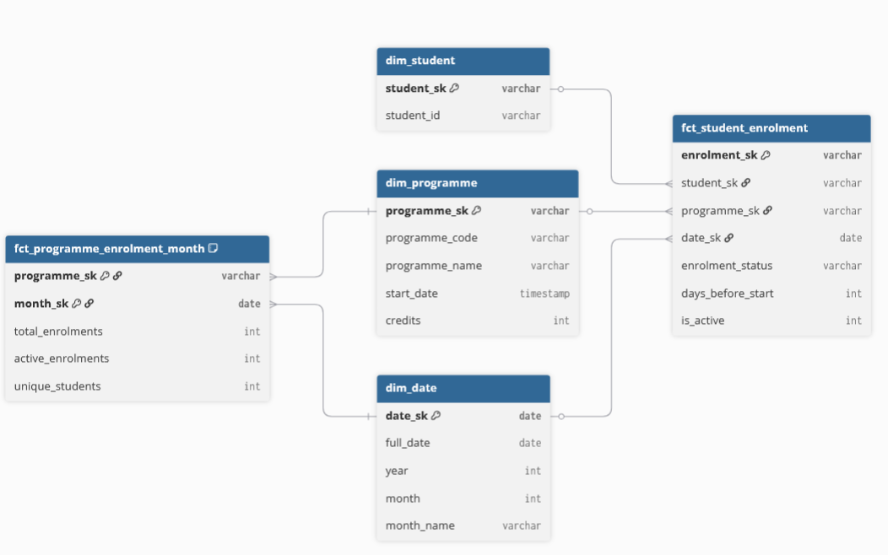
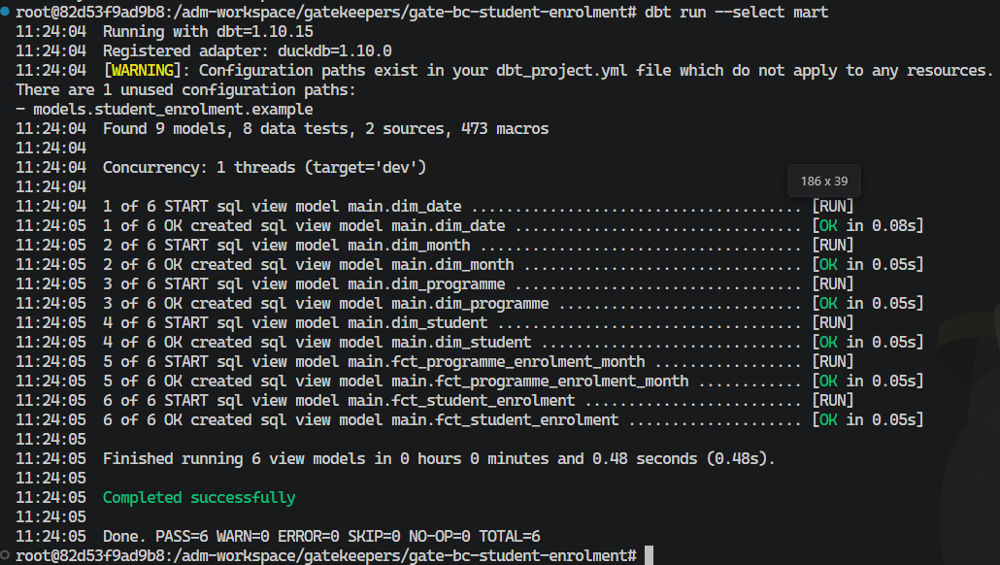
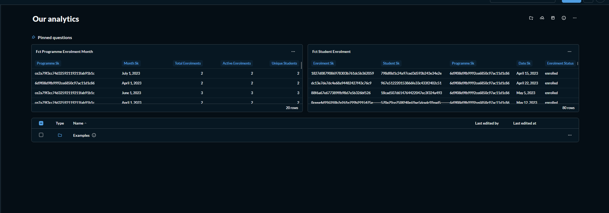

# Gate C — Answer Sheet

## Instructions

* Areas marked `<insert here>` are where you write your answers.
* Areas marked `![screenshot]` are where you paste screenshots.
* **Tip — pasting screenshots:** Use the [Paste Image](https://marketplace.visualstudio.com/items?itemName=mushan.vscode-paste-image) VS Code extension (Built into container).
* **Tip — export to PDF:** Use the [Markdown PDF](https://marketplace.visualstudio.com/items?itemName=yzane.markdown-pdf) VS Code extension. Export and submit the PDF to Brightspace (Built into container).
* **Gate C sign-off covers Phase 3. Phase 4 (dashboard).**

---

## Student Info

**Name:** `job bouwhuis`
**Class:** `2-Sb`
**Teacher:** `Melanie Bonnes`

---

# Phase 3 — Star Model, Implementation

**Exercise:** `student-preload → gatekeepers/gate-bc-student-enrolment`

---

## 3.1 — Grain Definitions

Define the grain for each fact table. Write it as: *"Each row represents one … in one …"*

**Primary grain:**

`Each row represents one student enrolment in one programme`

**Roll-up grain:**

`Each row represents total enrolments in one programme in one month`

---

## 3.2 — Metrics Table

Complete the table below for  **each fact table** . Justify why you chose that statistical operation rather than an obvious alternative.

### Primary Grain Fact Table

**Fact table name:** `fct_programme_enrolment`

| Metric name         | Source field        | Statistical operation             | Justification                                  |
|---------------------|---------------------|-----------------------------------|------------------------------------------------|
| `days_before_start` | `days_before_start` | `VALUE`                           | Each enrolment has its own unique value        |
| `is_active`         | `enrolment_status`  | `CASE WHEN = 1 THEN 1 ELSE 0`     | Reflects active status per enrolment event     |

### Roll-up Grain Fact Table

**Fact table name:** `fct_programme_enrolment_month`

| Metric name         | Source field        | Statistical operation | Justification                                         |
|---------------------|---------------------|----------------------|--------------------------------------------------------|
| `total_enrollments` | `student_id`        | `COUNT(*)`           | Counts enrolment events per programme per month        |
| `active_enrolments` | `enrolment_status`  | `COUNT FILTER`       | Isolates only active/enrolled status rows              |
| `unique_students`   | `student_id`        | `COUNT DISTINCT`     | Prevents double-counting repeat student appearances    |

---

## 3.3 — Star Model Design (DBML)

**Screenshot of your full star model DBML diagram (fact tables + dimension tables + relationships):**

---

## 3.4 — Implementation

**Files created:**

* `models/mart/dim_*.sql` — list the dimension models you created:

`dim_student.sql`
`dim_programme.sql`
`dim_date.sql`
`dim_month.sql`

* `models/mart/fct_*.sql` — list the fact models you created:

`fct_student_enrolment.sql`
`fct_programme_enrolment_month.sql`

**Screenshot — `dbt run` succeeding with all mart models built:**

---

# Phase 4 — Dashboard Validation

---

## 4.1 — Dashboard Screenshot

**Screenshot of your Metabase dashboard:**

---

## 4.2 — Grain Interpretation

In your own words, explain how changing the grain affects interpretation.

What does the **primary grain** reveal that the roll-up cannot?

`primary is one student per student, it says when the enrolment happened exactly, allowing you to see students who enrolled very early or very late`

What does the **roll-up grain** reveal that the primary grain cannot?

`The rollup shows trends, how much enrollments this month, how much last month, is it on trend, is it a unique situation, etc`
